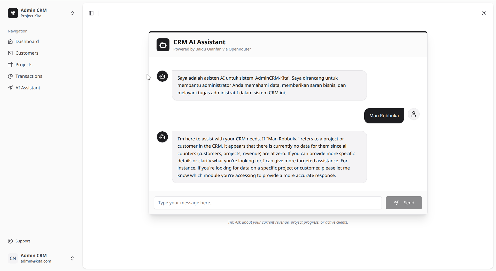

# AI-Smart-Agency-Dashboard 🚀

AI-Smart-Agency-Dashboard adalah sistem manajemen hubungan pelanggan (CRM) dan pengelolaan bisnis modern yang dirancang khusus untuk agensi dan penyedia jasa. Dibangun dengan teknologi mutakhir untuk memberikan pengalaman pengguna yang cepat, responsif, dan elegan.



## ✨ Fitur Utama

### 📊 Dashboard Analytics
*   **Real-time Metrics**: Pantau total pelanggan, proyek aktif, dan total pendapatan secara instan.
*   **Visualisasi Data**: Grafik interaktif menggunakan Recharts untuk melihat tren pendapatan (Bar Chart) dan distribusi status proyek (Pie Chart).
*   **Quick Insights**: Ringkasan performa bisnis dalam satu tampilan.

### 👥 Customer Management
*   **Lead Tracking**: Kelola siklus hidup klien dari Lead, Active, hingga Past Customer.
*   **Profil Lengkap**: Simpan detail kontak, alamat, dan riwayat klien dengan mudah.
*   **Modern UI**: Tabel data yang bersih dengan fitur CRUD yang cepat menggunakan shadcn/ui.

### 📁 Project Management
*   **Progress Tracking**: Pantau perkembangan setiap proyek dengan progress bar interaktif.
*   **Status Workflow**: Kelola proyek melalui berbagai tahapan (Planning, In Progress, Completed, On Hold).
*   **Deadline Management**: Pastikan setiap proyek selesai tepat waktu dengan pelacakan deadline.

### 💸 Transaction & Revenue
*   **Payment Tracking**: Catat setiap transaksi masuk dan hubungkan dengan proyek atau pelanggan tertentu.
*   **Attachment Support**: Unggah bukti pembayaran langsung ke sistem untuk verifikasi.
*   **Invoice Links**: Integrasi tautan invoice eksternal untuk kemudahan akses.

### 🤖 KitaAI - Integrated AI Assistant
*   **System-Aware AI**: Asisten cerdas yang memahami data bisnis Anda (menggunakan OpenRouter API).
*   **Business Intelligence**: Minta AI untuk menganalisis pendapatan, progres proyek, atau memberikan saran strategis.
*   **Natural Conversation**: Antarmuka chat premium untuk berinteraksi dengan AI secara langsung di dalam aplikasi.

## 🛠️ Tech Stack

*   **Backend**: [Laravel 11](https://laravel.com/)
*   **Frontend**: [React](https://reactjs.org/) dengan [Inertia.js](https://inertiajs.com/)
*   **Styling**: [Tailwind CSS](https://tailwindcss.com/) & [shadcn/ui](https://ui.shadcn.com/)
*   **Charts**: [Recharts](https://recharts.org/)
*   **AI Engine**: [OpenRouter](https://openrouter.ai/) (Gemini 2.0 / Baidu Qianfan)
*   **Database**: SQLite (Development) / MySQL (Production)

## 🚀 Instalasi

1.  **Clone Repositori**:
    ```bash
    git clone https://github.com/yourusername/AdminCRM-Kita.git
    cd AI-Smart-Agency-Dashboard
    ```

2.  **Instal Dependensi**:
    ```bash
    composer install
    npm install
    ```

3.  **Konfigurasi Environment**:
    ```bash
    cp .env.example .env
    php artisan key:generate
    ```

4.  **Siapkan Database**:
    ```bash
    touch database/database.sqlite
    php artisan migrate --seed
    ```

5.  **Konfigurasi AI (OpenRouter)**:
    Tambahkan key Anda ke file `.env`:
    ```env
    OPENROUTER_API_KEY="your_api_key_here"
    ```

6.  **Jalankan Aplikasi**:
    ```bash
    php artisan storage:link
    php artisan serve
    # Di terminal terpisah
    npm run dev
    ```

## 🎨 Design Philosophy

AdminCRM-Kita mengusung estetika **Modern & Premium**. Menggunakan palet warna yang lembut, border yang halus, dan efek fokus yang elegan untuk memastikan pengguna dapat bekerja dengan nyaman dalam waktu lama tanpa kelelahan mata.

---

Dibuat dengan ❤️ untuk efisiensi bisnis Anda.
